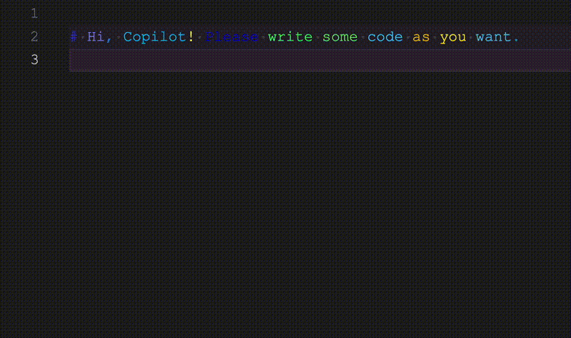

# ChaosCanvas

ChaosCanvas is a fun, experimental VSCode extension that brings colorful chaos to your code editor by painting every token in a random hue. Unlike traditional syntax highlighting that consistently colors tokens based on their type, ChaosCanvas applies completely random colors to each word or symbol, transforming your code into a vibrant work of abstract art.

## Features

- **Complete Randomness**: Every token (keywords, variables, symbols) gets its own random color
- **Language Independent**: Works with any programming language or text document
- **Dynamic Updates**: Colors update as you type or change the text
- **Simple Controls**: Toggle chaos mode on/off and shuffle colors with easy commands
- **Status Bar Integration**: Check chaos mode status and toggle it directly from the status bar

## How to Use

1. Install the ChaosCanvas extension
2. Open any file in VS Code
3. Right-click in the editor and select "Toggle Chaos Mode" to activate
4. Use "Shuffle Colors" to randomize the colors again when in chaos mode
5. Toggle chaos mode off to return to normal syntax highlighting
6. Alternatively, use the status bar item to check and toggle chaos mode

## Commands

The extension provides two commands:

- **Toggle Chaos Mode**: Activates or deactivates the random coloring
- **Shuffle Colors**: Generates new random colors for all tokens when chaos mode is active

Both commands are available in the editor context menu (right-click menu).

## Extension Settings

This extension contributes the following settings:

- `chaoscanvas.saturationRange`: Control the range of color saturation (0-100)
- `chaoscanvas.lightnessRange`: Control the range of color lightness (0-100)

## Performance Considerations

For very large files, ChaosCanvas may impact performance as it needs to create and manage decorations for every token in the document. Consider disabling the extension when working with extremely large files.

## Accessibility Warning

Due to the random nature of the color assignment, ChaosCanvas may create combinations with poor contrast or that are difficult to read for some users. This extension is intended as a fun experiment rather than a practical development tool.

## Release Notes

For detailed release notes, please check the [CHANGELOG](CHANGELOG.md).

## Development

### Running Tests

ChaosCanvas includes a comprehensive test suite to verify the extension's functionality:

1. Make sure to install dependencies with `npm install`
2. Install the [Extension Test Runner](https://marketplace.visualstudio.com/items?itemName=ms-vscode.extension-test-runner)
3. Run the "watch" task via the **Tasks: Run Task** command
4. Open the Testing view from the activity bar and click the "Run Test" button, or use the hotkey `Ctrl/Cmd + ; A`
5. View test results in the Test Results panel

The test suite includes:
- Basic extension activation tests
- Command registration and execution tests
- Editor decoration tests
- Performance tests for large files
- UI context and command visibility tests

---

**Enjoy the chaos!**
